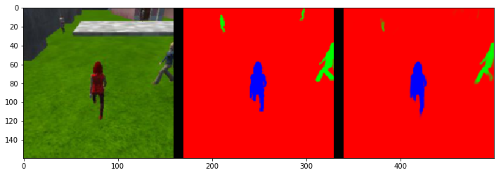
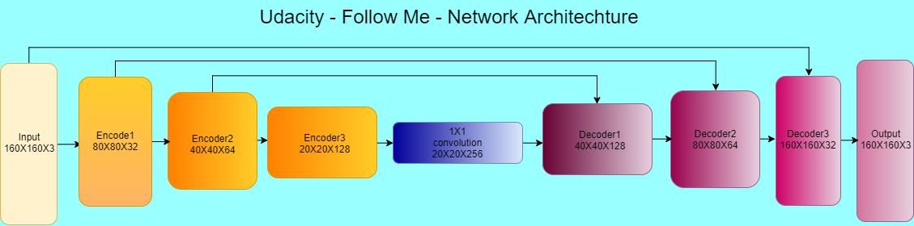
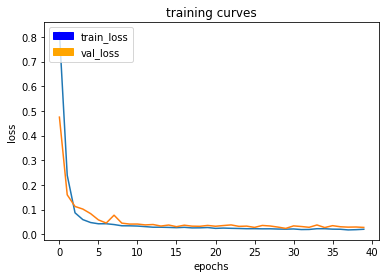
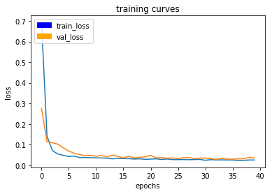
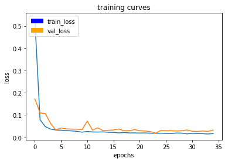

# Project: Follow Me

In this project, I have built a segmentation network, trained it, validated it, and deployed it.The main aim is to design and train a fully convolutional neural network (FCN) such that a drone can recognize a particular person and follow him/her. In the end, I will have a drone tracking and following a single hero target using a network pipeline.


## Project Road Map

A fully-convolutional neural network is used to identify a person.There are different types of people ,common people and our person of interest `Hero`, The main aim is t0 follow the `hero` .The dataset used is the new data set provided by udacity. 


### Dataset Exploration
The dataset provided by the course contains three files:

|data set|number of images |description|
|---|---|
|`train.zip`: training set|`images`: 4131 RGB images,`masks`: 4131 mask images |Target: Blue; Pedestrian: Green; Background: Red|
|`validation.zip`: validation set|`images`: 1184 RGB images,`masks`: 1184 mask images|To measure how well the network is trained, with out overfitting|
|`sample_evaluation_data.zip`: test set, used for evaluation.|||
|`following_images`: image data that Target in the center.|`images`: 542 RGB images,`masks`: 542 mask images||
|`patrol_non_targ`: image data without Target|`images`: 270 RGB images,`masks`: 270 mask images||
|`patrol_with_targ`: image data with Target|`images`: 322 RGB images, `masks`: 322 mask images||


To measure the model's performance, the IOU (intersection over union) metric is used which takes the intersection of the prediction pixels and ground truth pixels and divides it by the union of them.The trainning has been done in the udacity provided AWS udacity robotics community AMI.The target hero is wearing red cloths, where once trained it will be able to identify the hero from common people.



###  NETWORK ARCHITECTURE

Fully Convolutional Encoder-Decoder neural network is used. Comapared to the fully connected architecture, where the spacial information is lost, we can preserve it using FCN:

There are three contributions of fully convolutional network:
1. Instead of fully connected layers We use 1x1 convolution layer
2.  Upsampling is done by using  bilinear upsampling,which help in upsampling the previous layer to a desired resolution or dimension and helps speed up performance.The bilinear upsampling method does not contribute as a learnable layer like the transposed convolutions in the architecture and is prone to lose some finer details, but it helps speed up performance by reducing the trainable parameters
3. Skip connections, which allows to use information from multiple resolution scales



The above architecture contains two main parts: encoder and decoder, which are connected by a 1x1 convolutional layer.
I have implemented three layers for each encoder and decoder part of the architecture.With input image size of 160X160X3.

--------------------------------------------------------------------------------------------------------------------------------

``` python

def fcn_model(inputs, num_classes):
     # TODO Add Encoder Blocks. 
    # Remember that with each encoder layer, the depth of your model (the number of filters) increases.
    print("inputs",inputs)
    out0=conv2d_batchnorm(inputs, filters=32, strides=1)
    print("out0",out0)
    E1=encoder_block(out0, filters=32, strides=2)
    print("E1",E1)
    E2=encoder_block(E1, filters=64, strides=2) 
    print("E2",E2)
    E3=encoder_block(E2, filters=128, strides=2) 
    print("E3",E3)
    
    # TODO Add 1x1 Convolution layer using conv2d_batchnorm().
    M=conv2d_batchnorm(E3, filters=256, kernel_size=1, strides=1)
    print("M",M)

    # TODO: Add the same number of Decoder Blocks as the number of Encoder Blocks
    D1=decoder_block(M,E2, filters=128)
    print("D1",D1)
    D2=decoder_block(D1,E1, filters=64)
    print("D2",D2)
    D3=decoder_block(D2,inputs , filters=32)
    print("D3",D3)
    
    out=layers.Conv2D(num_classes, 1, activation='softmax', padding='same')(D3)
    print("out",out)
    # The function returns the output layer of your model. "x" is the final layer obtained from the last decoder_block()
    return out
    
```
```
    inputs Tensor("input_1:0", shape=(?, 160, 160, 3), dtype=float32)
    out0 Tensor("batch_normalization/batchnorm/add_1:0", shape=(?, 160, 160, 32), dtype=float32)
    E1 Tensor("batch_normalization_2/batchnorm/add_1:0", shape=(?, 80, 80, 32), dtype=float32)
    E2 Tensor("batch_normalization_3/batchnorm/add_1:0", shape=(?, 40, 40, 64), dtype=float32)
    E3 Tensor("batch_normalization_4/batchnorm/add_1:0", shape=(?, 20, 20, 128), dtype=float32)
    M Tensor("batch_normalization_5/batchnorm/add_1:0", shape=(?, 20, 20, 256), dtype=float32)
    D1 Tensor("batch_normalization_6/batchnorm/add_1:0", shape=(?, 40, 40, 128), dtype=float32)
    D2 Tensor("batch_normalization_7/batchnorm/add_1:0", shape=(?, 80, 80, 64), dtype=float32)
    D3 Tensor("batch_normalization_8/batchnorm/add_1:0", shape=(?, 160, 160, 32), dtype=float32)
    out Tensor("conv2d_3/truediv:0", shape=(?, 160, 160, 3), dtype=float32)
```
---------------------------------------------------------------------------------------------------------------------------------------

##### Encoder Layer:

The Model has several encoder blocks. All the encoder block has the a similar structure with :
- One Separable convolutional layers 
    > technique that reduces the number of parameters needed, thus increasing efficiency for the encoder network.The reduction in the parameters make separable convolutions quite efficient with improved runtime performance. They also have the added benefit of reducing overfitting to an extent, because of the fewer parameters.
- One batch normalization layer
    > Normalization for every layer of the network ,because distribution of each layer’s inputs changes during
training, as the parameters of the previous layers change, resulting in [internal covariate shift](https://arxiv.org/pdf/1502.03167.pdf). By performing Batch Normalization allows us to use much higher learning rates and be less careful about initialization without loosing accuracy.


##### 1x1 Convolutional Layer:

  > Generally the output of a convolutional layer is flattened into a fully connected layer into a 2D tensor, Where no information about the spatial information and features is preserved. Therefore 1x1 convolutions is used between encoder and decoder layer.1x1 convolution help in reducing the dimensionality of the layer. A fully-connected layer of the same size would result in the same number of features. However, replacement of fully-connected layers with convolutional layers presents an added advantage that during inference, you can feed images of any size into your trained network.

##### 1x1 Decoder Layer:
This layer contains:
- Bilinear Upsampling
    >Bilinear upsampling is a resampling technique that utilizes the weighted average of four nearest known pixels, located diagonally to a given pixel, to estimate a new pixel intensity value. The weighted average is usually distance dependent.
- Layer Concatenation
    > upsampling layers produce coarse segmentation maps because of loss of information during pooling. Therefore, skip connections are introduced from higher resolution feature maps. And followed by a `Seperable convolution layer`.

### Working

>Encoder layer extracts features for segmentation from the input image.We can extract small details in the initial layers  like curves and lines to shapes likes circles and patterns or grids and even try to learn even more complex features like face shapes and structures in the deeper layers.

>I have implemented three layers for each encoder and decoder part of the architecture,For each different layer might capture a different class or feature in the hierarchy of architecture. The first layer is the lowest level in the hierarchy, where the encoder layers generally classifies small parts of the image into simple shapes like horizontal and vertical lines and simple blobs of colors. The subsequent layers tend to be higher levels in the hierarchy and generally classify more complex ideas like shapes (combinations of lines), and eventually full objects. Arbitrarily i selected 2 encoder-decoder layers but did not achieve required score, then felt to use 3 layer architechure, which gave required results. 

> `filter depth`, Different filters pick up different qualities of a patch. For example, one filter might look for a particular color, while another might look for a kind of object of a specific shape.The more filters, the greater the depth of the activation map, and the more information we have about the input volume.As for why popular choices are 32 or 64, my understanding is that these powers of 2 are more convenient choices for optimizing GPU usage.
 
 
>The 1x1 convolution layer helps to achieve the functionality of fully-connected layer with added advantage of spacial information and you can feed images of any size into your trained network.

>Decoders is followed by 1x1 convolution layer, which again has series of layers which upscales using bilinear upsampling for the 
encoder output to get back the dimensions as the input image.There might not a complete restoration of the inforamtion in the upsampled image,which is lost during lost in the encoder layers, to compensate it we make  skip connections from encoder layer to decoder layer with similar height and width of intermidiate output encoder decoder blocks,we use layer concatenation (Concatenating two layers, the upsampled layer and a layer with more spatial information.) And the added advantage of concatenating the layers is that it offers a bit of flexibility because the depth of the input layers need not match up unlike when you have to add them element wise, which results in higher accuracy of segmentaion.The last layer is a convolutional output layer with softmax activation to get back the depth equalent to input.

### HYPERPARAMETERS

Parameters are selected by trail and error method:
And several parameters that i have tried are:

|Model|Final Score|Parameters|Graph|
|---|--|--|
|model1|0.41|<ul><li>learning_rate = 0.002</li><li>batch_size = 40</li><li> num_epochs = 20</li><li>validation_steps = 50</li><li> workers = 2</li><li>steps_per_epoch = 500</li></ul>|did not save|
|model2|0.38|<ul><li>learning_rate = 0.008</li><li>batch_size = 35</li><li> num_epochs = 35</li><li>validation_steps = 35</li><li> workers = 4</li><li>steps_per_epoch =125</li></ul>|did not save|
|model3_|0.378|<ul><li>learning_rate = 0.0008</li><li>batch_size = 16</li><li> num_epochs = 15</li><li>validation_steps = 50</li><li> workers = 20</li><li>steps_per_epoch = 500</li></ul>||
|model5|0.38|<ul><li>learning_rate = 0.0001</li><li>batch_size = 32</li><li> num_epochs = 40</li><li>validation_steps = 50</li><li> workers = 8</li><li>steps_per_epoch = 100</li></ul>|did not save|
|model6|0.371|<ul><li>learning_rate = 0.001</li><li>batch_size = 32</li><li> num_epochs = 40</li><li>validation_steps = 50</li><li> workers = 8</li><li>steps_per_epoch = 100</li></ul>|did not save|
|model7|0.37|<ul><li>learning_rate = 0.001</li><li>batch_size = 32</li><li> num_epochs = 40</li><li>validation_steps = 50</li><li> workers = 16</li><li>steps_per_epoch = 100</li></ul>||
|model8|0.36|<ul><li>learning_rate = 0.001</li><li>batch_size = 32</li><li> num_epochs = 20</li><li>validation_steps = 50</li><li> workers = 32</li><li>steps_per_epoch = 200</li></ul>||
|model3-3|0.422|<ul><li>learning_rate = 0.0015</li><li>batch_size =35 </li><li> num_epochs = 35</li><li>validation_steps =35</li><li> workers = 32</li><li>steps_per_epoch = 125</li></ul>||

```python
learning_rate = 0.0015 
    '''adam optimizer is use here,A high learning rate might overshoot the desired output but a small learning rate might take too long to reach the destination, after experimenting this learning rate seem a good value'''
batch_size = 35
    '''To train over entire dataset is computionally expensive and slow, so we use batches and 32 being standard batch size, i choose 35. '''
num_epochs = 35
    '''The number of iterations on the entire dataset. A huge num_epoch might overfit your data while a small
num_epoch might underfit your data.'''
steps_per_epoch = 125
     '''The standard choice `steps_per_epoch = num_images / batch_size + 1` , i choose value near to the standard value'''
validation_steps = 35
    '''number of batches of validation images that go through the network in 1 epoch. This is similar to steps_per_epoch, except validation_steps is for the validation dataset.The standard being `num_validation_images / batch_size + 1` i choose value near to standard value'''
workers = 32
    '''I have tired with 2,4... workers assuming p2.xlarge instance on AWS has 4 vCPU. but did not find much change in speed,But when i checked CPU usage for 4 workers was highest.'''
```


### Conclusion
The final score achieved for 3 encoder-decoder layers is **0.422**

Remarks:
1. The quad follows the target properly as expected. They detect the target, where average intersection over union for the hero is 0.91.
2. Models perform also good when there are no target visible.with number of false positives as 95.
3. Score for the neural network to detect the target from far away  is around 24%, It might because the small amount of training set.

This present model will not work well to follow another object (e.g dog, cat, car). Our target hero was wearing a red outfit ,so the trained data is specific to that features.following another object (dog, cat, car, etc.) instead of a human,  we should train  with classified images of that object (dog, cat, or car). We have only trained the model with classified images of humans from the simulator. Because of this, it learned to distinguish between the target human with red clothes and the other people in the simulator.Once we add more data with images of another object (dog, cat, car, etc.) and train the network again, then the model can identify different objects that are present in the training set.  

### Improvements

- To improve identifying the target from a far away,by incresing the depth of the network with more layers would enable learning smaller details.

- To increase the dataset would increase the target identification and accuracy.